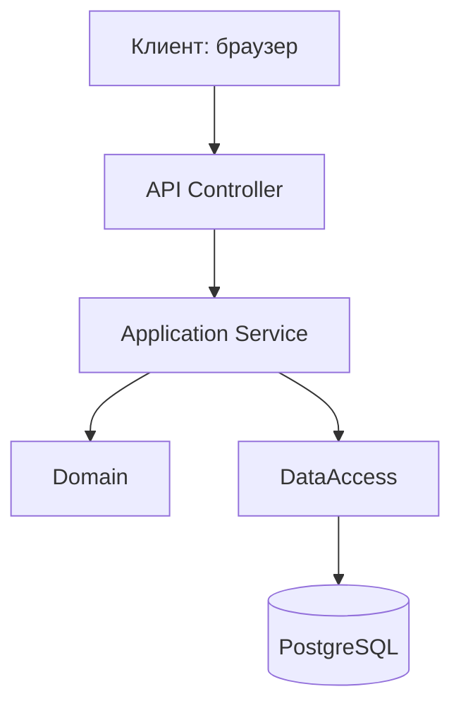
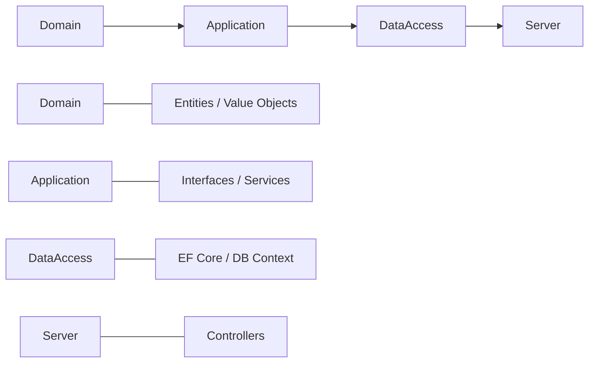
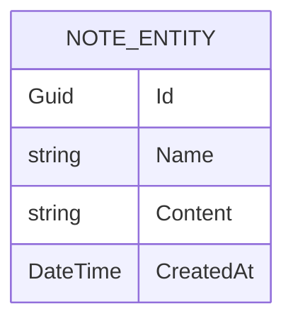
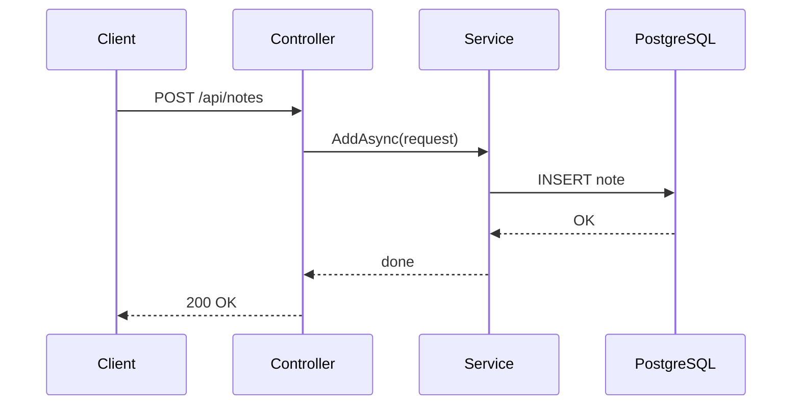

# Техническое руководство по созданию API для базы данных заметок на ASP.NET Core

**Тема:** проектирование и разработка серверного API для работы с заметками на базе **C#**, **ASP.NET Core**, **Entity Framework Core**, **PostgreSQL**, **Docker** и **docker-compose**.

**Цель документа:** показать последовательность исследования предметной области, описать архитектуру решения и дать начинающим пошаговое руководство по созданию похожего проекта.

---

## 1. Краткое описание проекта

В рамках проекта разрабатывается серверное API для хранения и обработки заметок. Система поддерживает базовые операции:

* создание заметки;
* получение заметки по идентификатору;
* получение списка заметок;
* обновление заметки;
* удаление заметки.

Проект реализован в стиле **Clean Architecture**, где слои приложения разделены по ответственности. Для хранения данных используется **PostgreSQL**, доступ к базе данных осуществляется через **Entity Framework Core**, а развёртывание упрощается за счёт **Docker** и **docker-compose**.

---

## 2. Последовательность действий по исследованию предметной области и созданию технологии

### Этап 1. Анализ предметной области

На этом этапе определяется, что именно будет хранить система, какие данные являются основными и какие операции должны быть доступны пользователю.

Для предметной области «заметки» были выделены следующие сущности и действия:

* сущность **Note** с полями `Id`, `Name`, `Content`, `CreatedAt`;
* создание и редактирование текста заметки;
* получение одной заметки или списка всех заметок;
* удаление заметки;
* последующее расширение модели без нарушения существующей архитектуры.

### Этап 2. Проектирование архитектуры

После анализа предметной области выбирается архитектура. Для данного проекта оптимально использовать **Clean Architecture**, так как она:

* отделяет бизнес-логику от инфраструктуры;
* облегчает тестирование;
* упрощает масштабирование;
* делает код понятным для сопровождения.

### Этап 3. Проектирование структуры данных

На основе предметной области создаётся сущность `NoteEntity` и таблица в PostgreSQL. Подбираются типы данных, ограничения и связи.

### Этап 4. Реализация серверной части

Создаются:

* контроллеры API;
* сервисы бизнес-логики;
* модели запросов;
* контекст базы данных;
* миграции EF Core;
* конфигурация Docker.

### Этап 5. Проверка и контейнеризация

После реализации проект проверяется локально и запускается в контейнерах. Это позволяет быстро развернуть систему на любой машине без ручной настройки окружения.

---

## 3. Архитектура проекта

### 3.1. Общая схема слоёв



### 3.2. Clean Architecture



### 3.3. Схема сущности заметки



### 3.4. Поток выполнения CRUD-запроса



---

## 4. Структура репозитория

Рекомендуемая структура проекта (именно для API):

```txt
├── src/
│   ├── Server/
│   ├── Application/
│   ├── Domain/
│   ├── DataAccess/
│   └── Server/
├── Dockerfile
└── docker-compose.yml
```

### Назначение папок

| Папка            | Назначение                                        |
| ---------------- | ------------------------------------------------- |
| `Domain`         | Сущности и базовые модели предметной области      |
| `Application`    | Интерфейсы сервисов, бизнес-правила          |
| `DataAccess` | Работа с PostgreSQL, EF Core, внешние зависимости |
| `Server`         | Контроллеры и точка входа API                     |

---

## 5. Пошаговое руководство по созданию проекта

### Шаг 1. Создайте решение и проекты

Создайте solution и четыре проекта:

* `Server` — ASP.NET Core Web API;
* `Application` — библиотека классов;
* `Domain` — библиотека классов;
* `DataAccess` — библиотека классов.

Пример команд в консоли linux:

```bash
mkdir NotesApi
cd NotesApi

dotnet new sln

dotnet new webapi -n Server
dotnet new classlib -n Application
dotnet new classlib -n Domain
dotnet new classlib -n DataAccess

dotnet sln add Server/Server.csproj
dotnet sln add Application/Application.csproj
dotnet sln add Domain/Domain.csproj
dotnet sln add DataAccess/DataAccess.csproj
```

### Шаг 2. Настройте ссылки между проектами

```bash
cd Application
dotnet add reference ../Domain/Domain.csproj

cd ../DataAccess
dotnet add reference ../Application/Application.csproj
dotnet add reference ../Domain/Domain.csproj

cd ../Server
dotnet add reference ../Application/Application.csproj
dotnet add reference ../DataAccess/DataAccess.csproj
```

### Шаг 3. Установите необходимые пакеты

Для `DataAccess`:

```bash
 dotnet add package Microsoft.EntityFrameworkCore
 dotnet add package Microsoft.EntityFrameworkCore.Design
 dotnet add package Microsoft.EntityFrameworkCore.Tools
 dotnet add package Npgsql.EntityFrameworkCore.PostgreSQL
```

Для `Server`:

```bash
 dotnet add package Swashbuckle.AspNetCore
```

---

## 6. Реализация доменной модели

### 6.1. Базовая сущность

```csharp
namespace Domain.Entities;

public abstract class BaseEntity
{
    public Guid Id { get; set; }
}
```

### 6.2. Сущность заметки

```csharp
namespace Domain.Entities;

public class NoteEntity : BaseEntity
{
    public string Name { get; set; } = string.Empty;
    public string Content { get; set; } = string.Empty;
    public DateTime CreatedAt { get; set; }
}
```

### 6.3. Почему так удобно

* `Id` позволяет однозначно идентифицировать запись;
* `Name` хранит заголовок заметки;
* `Content` содержит основной текст;
* `CreatedAt` фиксирует дату создания.

---

## 7. Модели запросов

Чтобы API было удобным и безопасным, полезно использовать отдельные DTO для входящих данных.

```csharp
namespace Domain.Models.Notes;

public record NoteRequest(string Name, string Content);
```

```csharp
namespace Domain.Models.Notes;

public record UpdateNoteRequest(Guid Id, string NewName, string NewContent);
```

---

## 8. Интерфейс сервиса

В слое Application описывается контракт сервиса.

```csharp
using Domain.Entities;
using Domain.Models.Notes;

namespace Application.Abstractions.Services;

public interface INoteService
{
    Task AddAsync(NoteRequest request);
    Task<NoteEntity> GetAsync(Guid id);
    Task<IEnumerable<NoteEntity>> GetAsync();
    Task UpdateAsync(UpdateNoteRequest request);
    Task DeleteAsync(Guid id);
}
```

### Зачем нужен интерфейс

Интерфейс позволяет:

* отделить бизнес-логику от реализации;
* заменить хранение данных без изменения контроллеров;
* облегчить тестирование.

---

## 9. Контроллер API

Ваш контроллер уже задаёт хороший стандартный CRUD-интерфейс.

```csharp
using Application.Abstractions.Services;
using Domain.Models.Notes;
using Microsoft.AspNetCore.Mvc;

namespace Server.Controllers;

[ApiController]
[Route("api/[controller]")]
public sealed class NotesController(INoteService noteService) : ControllerBase
{
    private readonly INoteService _noteService = noteService;

    [HttpPost]
    public async Task<IActionResult> Create(NoteRequest request)
    {
        await _noteService.AddAsync(request);
        return Ok();
    }

    [HttpGet("{id}")]
    public async Task<IActionResult> Get(Guid id)
    {
        var note = await _noteService.GetAsync(id);
        return Ok(note);
    }

    [HttpGet]
    public async Task<IActionResult> Get()
    {
        var notes = await _noteService.GetAsync();
        return Ok(notes);
    }

    [HttpPut]
    public async Task<IActionResult> Update(UpdateNoteRequest request)
    {
        await _noteService.UpdateAsync(request);
        return Ok();
    }

    [HttpDelete("{id}")]
    public async Task<IActionResult> Delete(Guid id)
    {
        await _noteService.DeleteAsync(id);
        return Ok();
    }
}
```

### Что делает контроллер

Контроллер принимает HTTP-запросы, передаёт их в сервис и возвращает ответ клиенту. Вся бизнес-логика должна оставаться в сервисе, а не в контроллере.

---

## 10. Реализация EF Core и PostgreSQL

### 10.1. Контекст базы данных

```csharp
using Domain.Entities;
using Microsoft.EntityFrameworkCore;

namespace DataAccess;

public sealed class AppDbContext(DbContextOptions<AppDbContext> options) : DbContext(options)
{
	public DbSet<NoteEntity> Notes { get; set; }
	
	protected override void OnModelCreating(ModelBuilder modelBuilder)
	{
		modelBuilder.ApplyConfigurationsFromAssembly(typeof(AppDbContext).Assembly);
	
	}
}
```

### 10.2. Регистрация DbContext

```csharp
using DataAccess;
using Microsoft.EntityFrameworkCore;

services.AddDbContext<AppDbContext>(options =>
	options.UseNpgsql(configuration.GetConnectionString(nameof(AppDbContext)))
);
```

### 10.3. Строка подключения

```json
{
  "ConnectionStrings": {
	"AppDbContext": "Server=db;Port=5432;Database=app_db;Username=app_db;Password=app_db_password_1234;"
	
	}
}
```

---

## 11. Реализация сервиса

Ниже приведён пример упрощённого сервиса.

```csharp
using Application.Abstractions.Services;
using Domain.Entities;
using Domain.Models.Notes;
using DataAccess.Persistence;
using Microsoft.EntityFrameworkCore;

namespace DataAccess.Services;

public sealed class NoteService(AppDbContext context) : INoteService
{
    private readonly AppDbContext _context = context;

    public async Task AddAsync(NoteRequest request)
    {
        var note = new NoteEntity
        {
            Id = Guid.NewGuid(),
            Name = request.Name,
            Content = request.Content,
            CreatedAt = DateTime.UtcNow
        };

        await _context.Notes.AddAsync(note);
        await _context.SaveChangesAsync();
    }

    public async Task<NoteEntity?> GetAsync(Guid id)
        => await _context.Notes.FirstOrDefaultAsync(x => x.Id == id);

    public async Task<IEnumerable<NoteEntity>> GetAsync()
        => await _context.Notes.OrderByDescending(x => x.CreatedAt).ToListAsync();

    public async Task UpdateAsync(UpdateNoteRequest request)
    {
        var note = await _context.Notes.FirstOrDefaultAsync(x => x.Id == request.Id);
        if (note is null)
        {
            return;
        }

        note.Name = request.Name;
        note.Content = request.Content;

        await _context.SaveChangesAsync();
    }

    public async Task DeleteAsync(Guid id)
    {
        var note = await _context.Notes.FirstOrDefaultAsync(x => x.Id == id);
        if (note is null)
        {
            return;
        }

        _context.Notes.Remove(note);
        await _context.SaveChangesAsync();
    }
}
```

---

## 12. Регистрация зависимостей

В `Program.cs` необходимо подключить сервисы:

```csharp
using DataAccess;
using Microsoft.AspNetCore.CookiePolicy;
using Microsoft.EntityFrameworkCore;
using Server.Extensions;

var builder = WebApplication.CreateBuilder(args);

var services = builder.Services;
var configuration = builder.Configuration;

// Add services to the container.

services.AddEndpointsApiExplorer();
services.AddSwaggerGen();

services.AddControllers();

services.AddCors(option =>
{
    option.AddDefaultPolicy(policy =>
    {
        policy.WithOrigins("https://localhost:5000/");
        policy.AllowCredentials();
        policy.AllowAnyHeader();
        policy.AllowAnyMethod();
    });
});

services.AddRepositories();

services.AddServices();

services.AddDbContext<AppDbContext>(options =>
    options.UseNpgsql(configuration.GetConnectionString(nameof(AppDbContext)))
);

// Learn more about configuring OpenAPI at https://aka.ms/aspnet/openapi

var app = builder.Build();

using var scope = app.Services.CreateScope();
await using var dbContext = scope.ServiceProvider.GetRequiredService<AppDbContext>();
await dbContext.Database.EnsureCreatedAsync();

// Configure the HTTP request pipeline.
if (app.Environment.IsDevelopment())
{
    app.UseSwagger();
    app.UseSwaggerUI();
}

app.UseHttpsRedirection();

app.UseCookiePolicy(
    new CookiePolicyOptions
    {
        MinimumSameSitePolicy = SameSiteMode.None,
        HttpOnly = HttpOnlyPolicy.Always,
        Secure = CookieSecurePolicy.Always,
    }
);

app.UseCors();

app.MapControllers();

app.Run();
```


---

## 13. Docker и docker-compose

### 13.1. Dockerfile

```dockerfile
# https://hub.docker.com/_/microsoft-dotnet
FROM mcr.microsoft.com/dotnet/sdk:10.0 AS build
WORKDIR /source

# copy csproj and restore as distinct layers
COPY ./Server/pp.csproj ./Server/
RUN dotnet restore "./Server/pp.csproj"

# copy everything else and build app
COPY . .
WORKDIR /source/Server
RUN dotnet publish -c release -o /app

# final stage/image
FROM mcr.microsoft.com/dotnet/aspnet:10.0
WORKDIR /app
COPY --from=build /app ./
ENTRYPOINT ["dotnet", "pp.dll"]
```

### 13.2. docker-compose.yml

```yaml
services:
  client:
    container_name: pp.client
    ports:
      - "5173:5173"
    build:
      context: ./site
      dockerfile: ./Dockerfile
    volumes:
      - ./site:/site
    depends_on:
      - api
      
  api:
    container_name: pp.server
    ports:
      - "8080:8080"
    environment:
      - ASPNETCORE_ENVIRONMENT=Development
      - ASPNETCORE_HTTP_PORTS=8080
    build:
      context: ./src
      dockerfile: ./Dockerfile
    volumes:
      - ./:/source 
    networks:
      - app
    depends_on:
      - db

  db:
    container_name: pp.db
    image: postgres:latest
    restart: always
    ports:
      - "5432:5432"
    environment:
      POSTGRES_DB: app_db
      POSTGRES_USER: app_db
      POSTGRES_PASSWORD: app_db_password_1234
    networks:
      - app
    volumes:
      - postgres_data:/var/lib/postgresql

networks:
  app:
    driver: bridge

volumes:
  postgres_data:
```

### 13.3. Запуск контейнеров

```bash
 docker compose up --build
```

---

## 14. Таблица API-методов

| Метод    | URL               | Описание                           |
| -------- | ----------------- | ---------------------------------- |
| `POST`   | `/api/notes`      | Создать заметку                    |
| `GET`    | `/api/notes`      | Получить список заметок            |
| `GET`    | `/api/notes/{id}` | Получить заметку по идентификатору |
| `PUT`    | `/api/notes`      | Обновить заметку                   |
| `DELETE` | `/api/notes/{id}` | Удалить заметку                    |

---

## 15. Вывод

В результате была создана серверная технология на базе C# и ASP.NET Core, реализующая хранение и управление заметками через REST API. Архитектура Clean Architecture разделяет проект по слоям и делает его удобным для сопровождения и расширения. Использование EF Core и PostgreSQL обеспечивает надёжную работу с данными, а Docker и docker-compose упрощают запуск и перенос проекта на другие устройства.
